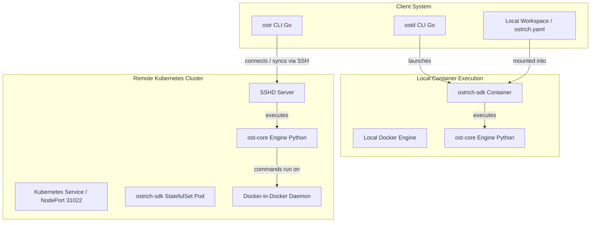

# Ostrich SDK - System Description & Architecture

This document provides a detailed technical breakdown of the Ostrich SDK. It is designed to help engineers and AI agents understand the codebase, the execution lifecycle, and the integration patterns across different components.

---

## 1. High-Level Architecture & Components

Ostrich SDK is a modular application deployment framework based on the following three-tier system:

---

## 2. Core Engine (`ost-core`)

The execution engine is written in Python 3. It compiles templates, resolves configurations, coordinates dependencies, and executes task operations.

### Configuration & Templates (Osplates)
- **`ostrich.yaml` (Plugin Config):** The main descriptor file in the application workspace that specifies:
  - `plugin.name`, `plugin.business_name`, and `plugin.version`.
  - `template.kind` (the name of the target osplate to use).
  - Target-specific parameters injected into template files.
- **Osplates Structure:** Located in `ost-core/templates/` (or custom locations). Each template is a directory containing:
  - `template.yaml`: Defines global configuration for the template (e.g., default `runner.kind`).
  - `default.yaml`: Specifies default settings.
  - Directories representing **operations** (e.g., `deploy`, `package`, `build`).
  - Under each operation directory, templated source files (e.g., `deployment.yaml.tmpl`) and operation configs (e.g., `deploy.yaml`) specify what commands to execute.

### Jinja2 Templating
Ostrich SDK uses **Jinja2** to render templates. To prevent clashing with Helm chart brackets (`{{ }}`) or Kubernetes configs, Ostrich overrides Jinja's defaults:
- **Variable Start:** `[[`
- **Variable End:** `]]`

### Operations and Runners
When a task/operation is run (e.g., `ost run deploy`), the engine looks up the designated runner defined in `[operation]/[operation].yaml` or `template.yaml`.
Ostrich supports three runners:

1. **`inprocess`:**
   - Runs Python scripts directly in the current interpreter session.
   - Looks for `pretemplate.py` or script modules in the template files to execute python-native logic.
2. **`shell`:**
   - Runs local shell commands sequentially as defined under the `commands` section in the operation YAML.
3. **`container`:**
   - Sandboxes execution inside a docker or podman container.
   - Dynamically builds a container run command (e.g., `docker run --rm`), mounting the workspace and cluster files (`.kube/config`), setting environment variables (`LOGLEVEL`, `DRYRUN`), mapping the container UID/GID to match the host system (preventing permission lockouts), and executing commands inside the sandboxed environment.

---

## 3. Local Docker CLI Client (`ostd-cli`)

`ostd` is a Go-based wrapper that packages the runtime environment inside a Docker container (default: `ghcr.io/rockops/ostrich-sdk:latest`), shielding the developer from installing tools like Python, Helm, Kubectl, Jinja2, etc., locally.

### Key Logic & Volume Mounting:
- **Workdir Mounts:** Mounts the current host working directory into the container workspace path `OST_WORKSPACE`.
- **Identity & SSH keys:** Mounts host credentials like `~/.kube/config` to `/kubeconfig` inside the container, and `~/.docker/config.json` to `/sdk/.docker/config.json` (read-only).
- **Docker socket:** Mounts `/var/run/docker.sock` to enable building/pushing container images from inside the sandbox.
- **User mappings:** On Linux, detects host UID/GID (`os.Getuid()`, `os.Getgid()`) and passes them (`-u uid:gid`) along with the local `docker` group ID (`--group-add`) to ensure file permissions match the developer's local user.

---

## 4. Remote Kubernetes CLI Client (`ostr-cli`)

`ostr` is a Go-based CLI that interacts with a remote Ostrich deployment (typically inside a Kubernetes cluster) where the Ostrich SDK is running as a stateful SSH server.

### Workflow Lifecycle:
1. **Initialize Connection:**
   - `ostr init` lets users configure remote connection endpoints. Configs are stored under `~/.ostrich/config` (including host IP/domain, SSH port, and credentials).
2. **Folder Sync:**
   - When running a command (e.g., `ostr run deploy`), the client computes the workspace directory using the current SSH endpoint UUID and the plugin name: `pathJoin(UUID, pluginName)`.
   - It performs an incremental file synchronization over SFTP/SSH to upload the local directory contents (including `ostrich.yaml` and source templates) to the remote server.
3. **Remote Task Execution:**
   - It invokes `/sdk/ost` on the remote server over SSH interactive terminal sessions.
   - Passes relevant environment variables and options to ensure the remote deployment runs identically to a local sandbox.

---

## 5. Kubernetes & Docker Daemon Setup (Helm & SSHD)

The remote infrastructure is deployed via a **Helm chart** inside a Kubernetes cluster:

- **StatefulSet:** The container (`ostrich-sdk-ssh`) runs with root privileges (`privileged: true`) and acts as an SSH server.
- **Docker-in-Docker (DinD):** An auxiliary background docker daemon (`dockerd`) is spawned inside the container during entrypoint initialization (`entry.sh`), allowing nested Docker executions (building and pushing containers directly from the remote pod).
- **Permissions:** Sudo configurations are established to allow the non-root `sdk` user to execute user management scripts safely.
- **Storage:** Volume claim templates ensure persistent storage for `/var/lib/docker`, key directories (`/etc/authorized_keys`), and `/home` folders.
